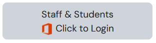

# Welcome

## Moodle Onboarding

<figure><figcaption></figcaption></figure>

To log into Moodle, you will need an office SETU Office 365 account. All staff members are supplied with an Office 365 account from Computer Services. If you have not received your SETU Office 365 account, please contact [Computer Services](https://techcentral.setu.ie/)

Moodle is a learning management system (LMS) here at SETU, and you access Moodle through a web browser; think of it as your “Module Hub” where you upload content, run activities (assignments, forums, quizzes), and track learners on the Module/s you teach.

## Access

To access Moodle, please visit [https://moodle.setu.ie/](https://moodle.setu.ie/)

Log in via the Staff or Students Option

<figure><figcaption></figcaption></figure>

You will be prompted to enter your SETU Office 365 account username

_**staff.name@setu.ie**_ for staff members.

_**12345678@setu.ie**_ for students - more information on the student accounts [here](https://techcentral.setu.ie/computer-services-waterford/student-support-and-services#student-accounts)

## Module access

All modules in Moodle will have the CRN (5-digit number) integrated into the title of the module, the full title will contain 3 parts

1. The full title
2. The CRN
3. The academic year

To request access to a Moodle module, email the Moodle Helpdesk with the module CRN and the access level you need: edit, non-edit, or view access.

